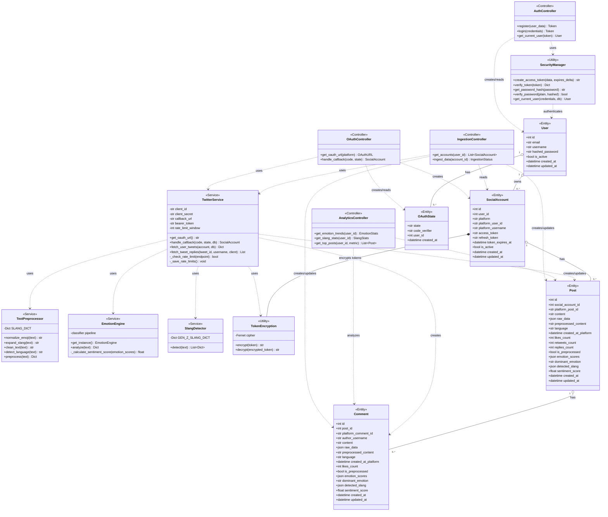

# Class Diagram - SocialMonkey Platform

## System Architecture Overview

This class diagram represents the complete architecture of the SocialMonkey platform across **Iteration 1** (OAuth, Data Ingestion, Text Preprocessing) and **Iteration 2** (Emotion Analysis, Slang Detection, Analytics).

---

## Mermaid Class Diagram

---

## Legend

| Symbol           | Meaning                                     |
| ---------------- | ------------------------------------------- |
| `<<Controller>>` | API endpoint handlers (FastAPI routers)     |
| `<<Service>>`    | Business logic and external integrations    |
| `<<Utility>>`    | Helper classes and utilities                |
| `<<Entity>>`     | Database models (SQLAlchemy)                |
| `<<Singleton>>`  | Class instantiated only once                |
| `---\|>`         | Generalization (Inheritance)                |
| `o--`            | Aggregation (has-a, independent lifecycle)  |
| `*--`            | Composition (contains, dependent lifecycle) |
| `..>`            | Dependency (uses)                           |
| `-->`            | Association                                 |

---

## Class Descriptions

### Controllers (API Layer)

- **AuthController**: Handles user registration, login, and authentication
- **OAuthController**: Manages OAuth 2.0 flow for social platform connections
- **IngestionController**: Triggers data sync from connected social accounts
- **AnalyticsController**: Provides aggregated analytics and insights

### Services (Business Logic)

- **TwitterService**: OAuth and data fetching for Twitter platform
- **TextPreprocessor**: Cleans and normalizes social media text
- **EmotionEngine**: AI-powered emotion detection using RoBERTa transformer
- **SlangDetector**: Gen-Z slang term identification and interpretation

### Utilities

- **TokenEncryption**: Fernet symmetric encryption for OAuth tokens
- **SecurityManager**: JWT token management and password hashing (bcrypt)

### Entities (Database Models)

- **User**: Platform users with authentication credentials
- **SocialAccount**: Connected social media accounts (Twitter, Instagram)
- **Post**: Social media posts with emotion and slang analysis
- **Comment**: Replies/comments on posts with analysis
- **OAuthState**: Temporary storage for OAuth PKCE flow

---

## Module Breakdown

### Iteration 1 - Core Infrastructure

- **Controllers**: AuthController, OAuthController, IngestionController
- **Services**: TwitterService, TextPreprocessor
- **Utilities**: TokenEncryption, SecurityManager
- **Entities**: User, SocialAccount, Post, Comment, OAuthState

### Iteration 2 - AI & Analytics

- **Services**: EmotionEngine (Module 2), SlangDetector (Module 3)
- **Controllers**: AnalyticsController
- **Entity Extensions**: Added `emotion_scores`, `dominant_emotion`, `detected_slang`, `sentiment_score` to Post and Comment

---

## Key Design Patterns

1. **Singleton Pattern**: EmotionEngine loads ML model once for efficiency
2. **Service Layer Pattern**: Business logic separated from controllers
3. **Repository Pattern**: Database access abstracted through SQLAlchemy ORM
4. **Dependency Injection**: FastAPI `Depends()` for service and auth dependencies
5. **Encryption at Rest**: OAuth tokens encrypted before database storage

---

## Technology Stack

- **Backend Framework**: FastAPI (Python)
- **Database**: PostgreSQL with SQLAlchemy ORM
- **Authentication**: JWT (jose library), bcrypt password hashing
- **OAuth**: Twitter OAuth 2.0 with PKCE (Tweepy library)
- **AI/ML**: Hugging Face Transformers (RoBERTa-base-go_emotions)
- **Encryption**: Fernet symmetric encryption (cryptography library)
- **Text Processing**: langdetect, emoji, regex

---

_Generated for SocialMonkey FYP - Iteration 1 & 2 Complete System_
